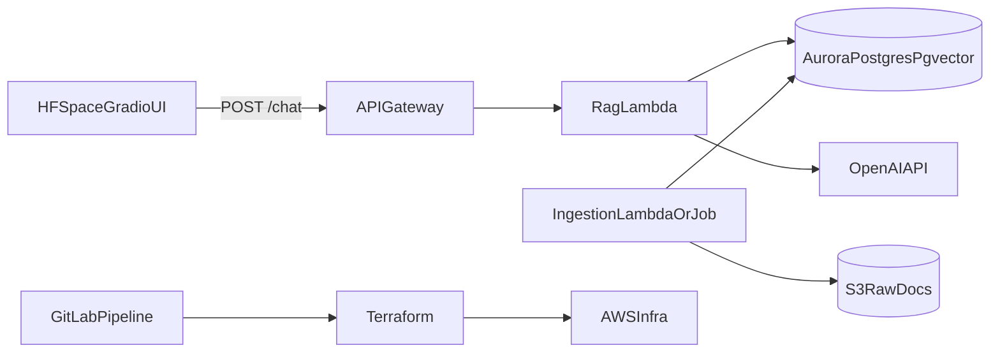

# AWS RAG Migration Plan (HF Frontend + AWS Backend)

## Target Outcome
Move from a single-file Gradio app to a split architecture:
- Hugging Face Space keeps the UI in [`/Users/davidnoorshargh/Workspace/career_conversations/app.py`](/Users/davidnoorshargh/Workspace/career_conversations/app.py)
- AWS hosts retrieval + generation APIs and ingestion
- Infrastructure is fully provisioned via Terraform
- Delivery is managed by GitLab pipelines (plan/apply + build/deploy)

## Architecture (v1)

## Phase 1 - Baseline and repo restructuring
- Keep current HF deploy path intact from [`.github/workflows/deploy-huggingface-space.yml`](/Users/davidnoorshargh/Workspace/career_conversations/.github/workflows/deploy-huggingface-space.yml) while introducing AWS services in parallel.
- Introduce backend folders without breaking current app:
  - `backend/api/` for Lambda handler and orchestration
  - `backend/rag/` for chunking/retrieval logic
  - `backend/ingest/` for document ingestion jobs
  - `infra/terraform/` for AWS IaC
  - `ops/gitlab/` for reusable CI templates/scripts
- Keep current source docs in `me/` as initial corpus (e.g. [`/Users/davidnoorshargh/Workspace/career_conversations/me/summary.txt`](/Users/davidnoorshargh/Workspace/career_conversations/me/summary.txt), [`/Users/davidnoorshargh/Workspace/career_conversations/me/linkedin.pdf`](/Users/davidnoorshargh/Workspace/career_conversations/me/linkedin.pdf)).

## Phase 2 - Define RAG data model and ingestion
- Define canonical chunk schema (stored in Aurora table):
  - `chunk_id`, `content`, `embedding vector`, `source`, `title`, `tags`, `updated_at`
- Build ingestion flow:
  - Parse source files (txt/pdf)
  - Normalize text
  - Chunk with overlap
  - Embed with OpenAI embeddings
  - Upsert into Aurora pgvector table
- Add ingestion modes:
  - manual trigger from pipeline
  - optional scheduled re-index job

## Phase 3 - Build AWS chat API
- Implement `POST /chat` endpoint:
  - Validate request
  - Embed query
  - Retrieve top-k chunks via pgvector similarity
  - Construct grounded prompt
  - Generate answer from OpenAI
  - Return answer + citations payload
- Implement supporting endpoints:
  - `GET /health`
  - `POST /ingest` (protected)
- Add guardrails:
  - fallback response when retrieval confidence is low
  - timeout/retry strategy around external APIs

## Phase 4 - Terraform infrastructure
- Create Terraform modules for:
  - VPC + private subnets for Aurora
  - Aurora PostgreSQL (pgvector enabled)
  - API Gateway
  - Lambda functions + IAM roles
  - S3 bucket for raw docs/ingestion artifacts
  - Secrets Manager entries (`OPENAI_API_KEY`, DB creds)
  - CloudWatch log groups/alarms
- Use separate workspaces or environments (`dev`, `prod`) with tfvars.
- Ensure least-privilege IAM for Lambda and pipeline role assumptions.

## Phase 5 - GitLab pipeline implementation
- Add GitLab CI stages:
  - `lint` and unit tests
  - `terraform_validate` and `terraform_plan`
  - manual-gated `terraform_apply` (prod)
  - package/deploy Lambda
  - run smoke checks against `/health`
- Configure environment-scoped variables in GitLab:
  - AWS role / credentials (OIDC preferred)
  - OpenAI/DB secret references
- Keep HF deployment separate initially; migrate from GitHub Actions to GitLab only after AWS path is stable.

## Phase 6 - HF frontend integration
- Refactor current chat flow in [`/Users/davidnoorshargh/Workspace/career_conversations/app.py`](/Users/davidnoorshargh/Workspace/career_conversations/app.py):
  - Replace direct OpenAI call with HTTP request to AWS `POST /chat`
  - Keep lead-capture tool behavior, but route storage/alerts through backend API where possible
  - Render citations returned by backend
- Store backend endpoint and auth token as HF Space secrets.

## Phase 7 - Reliability, security, and cost controls
- Add auth/rate-limiting on API Gateway.
- Add CloudWatch dashboards for latency, errors, and token usage.
- Add retention and cleanup policies for ingestion artifacts.
- Add simple RAG eval suite (question set + expected sources) to prevent regressions.

## Phase 8 - Cutover and deprecations
- Validate parity between old direct-chat behavior and new RAG backend.
- Switch production HF Space to AWS API endpoint.
- Retire old direct OpenAI path after soak period.
- Optionally migrate HF deploy automation from [`.github/workflows/deploy-huggingface-space.yml`](/Users/davidnoorshargh/Workspace/career_conversations/.github/workflows/deploy-huggingface-space.yml) to GitLab pipeline for single CI/CD control plane.

## Acceptance criteria
- HF UI successfully answers using AWS RAG backend with citations.
- Infra reproducible via Terraform in `dev` and `prod`.
- GitLab pipeline can plan/apply infra and deploy backend artifacts.
- Ingestion updates corpus without manual DB editing.
- Basic observability and alerts are in place.